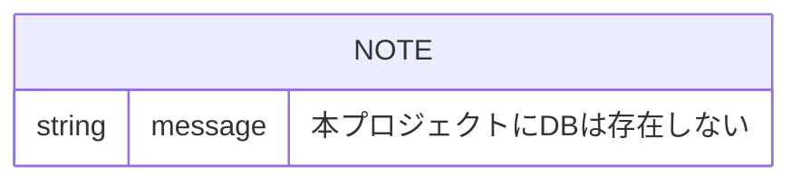

# データベース

---

## 概要

本プロジェクトの **現行実装** では、リレーショナルデータベースおよびその他の永続化ストアは使用していない。

ニュースデータ・要約データはフロントエンドの React ステート（メモリ）上にのみ保持され、ページリロードで失われる。設定情報は `backend/search-config.json` ファイルで管理される。

### 不使用の理由

- アプリの軽量化
- 投稿情報を保存する想定がない

### 将来計画

ニュース情報からのトレンド収集を行う際には、PostgreSQL 等へ情報を永続化することを想定している。本番環境のサンプル構成は [docs/system_architecture.md](system_architecture.md) を参照。

---

## ER 図

データベースが存在しないため、ER 図は該当なし。

---

## テーブル一覧

該当なし。

---

## データ永続化の代替手段

| データ種別 | 保存場所 | 形式 | 備考 |
|-----------|---------|------|------|
| カテゴリ・検索設定 | `backend/search-config.json` | JSON ファイル | サーバー起動時に読み込み |
| ニュース一覧 | フロントエンド React ステート | メモリ | 取得のたびに再取得 |
| 要約 | フロントエンド React ステート | メモリ | Slack 投稿前に編集可能 |
| Slack Webhook URL | `backend/.env` | 環境変数 | Git 管理対象外 |

---

## 命名規則

データベースが存在しないため、DB 命名規則は該当なし。

設定ファイル（`search-config.json`）のキー命名:

| キー | 説明 |
|------|------|
| `categories` | カテゴリ配列 |
| `id` | カテゴリ識別子（例: `labor`, `ai`, `none`） |
| `name` | カテゴリ表示名 |
| `keywords` | RSS 検索キーワード配列 |
| `filters` | RSS 検索フィルタ配列 |
| `validationKeywords` | 要約関連性検証キーワード配列 |

---

## マイグレーション方針

現行: 該当なし（DB 未使用）。

将来 DB（PostgreSQL）導入時は、本ドキュメントに ER 図・テーブル定義を追記し、`docs/decision_log.md` に設計判断を記録する。
