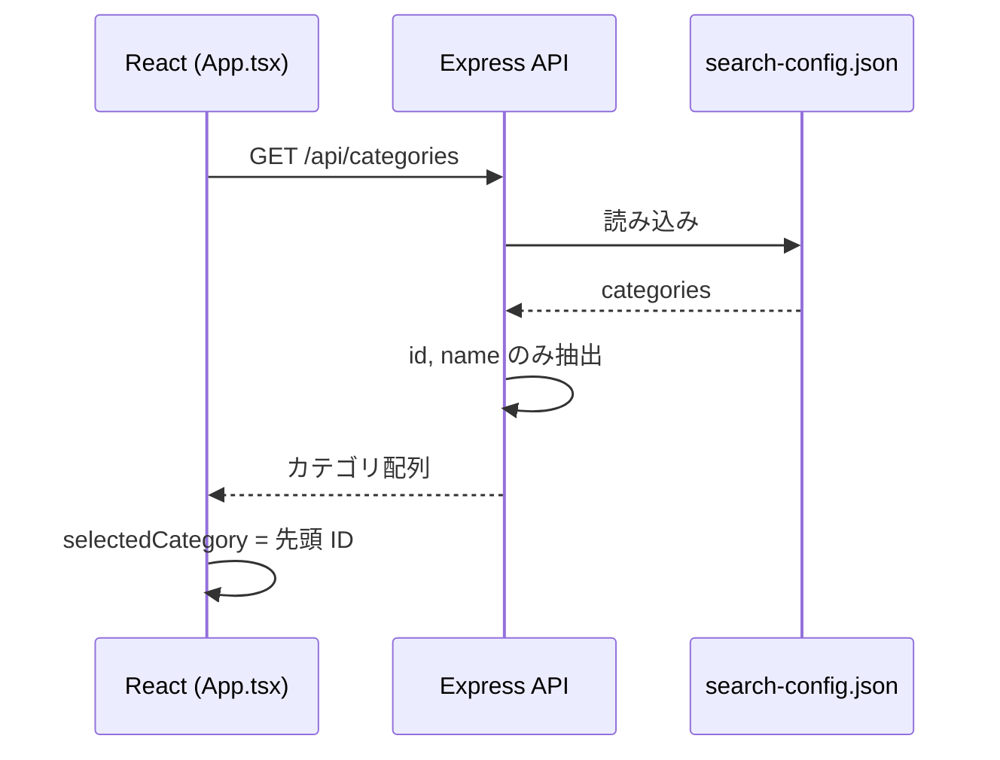

# カテゴリ選択

---

## 機能概要

`search-config.json` で定義されたニュースカテゴリをプルダウンで選択する機能。選択したカテゴリはニュース取得・要約作成時の検索条件および関連性検証に使用される。

---

## 対象ユーザー

社内担当者。

---

## 入力

| 項目 | 型 | 必須 | 説明 |
|------|-----|------|------|
| カテゴリ ID | string（select） | ○ | `<select>` の `value`（例: `labor`, `ai`, `none`） |

---

## 出力

| 項目 | 型 | 説明 |
|------|-----|------|
| カテゴリ一覧 | array | `{ id, name }` の配列 |
| 選択状態 | string | `selectedCategory` ステート |

---

## バリデーション

該当なし（選択肢は API から取得）。

---

## 業務ルール

- 初回マウント時に `GET /api/categories` で一覧取得
- 取得成功時、先頭カテゴリを `selectedCategory` に設定
- カテゴリ変更後、ニュース取得はユーザーが「最新ニュースを取得」を押すまで自動実行されない
- 要約作成時は **現在選択中のカテゴリ** の `validationKeywords` が使用される（記事取得時のカテゴリと一致させる運用が想定される）

### 定義済みカテゴリ（`search-config.json`）

| ID | 表示名 | keywords | filters | validationKeywords |
|----|--------|----------|---------|-------------------|
| `labor` | 労務 | 労働基準法, 社会保険, 雇用保険, 労務 | 改正, 変更, 最新, 義務化 | 労務, 雇用, 労働, ...（16 件） |
| `ai` | AI関連 | AI, 人工知能, LLM, 生成AI, ChatGPT, Claude, Gemini | ニュース, 新機能, 発表, リリース, アップデート | AI, 人工知能, 機械学習, ...（7 件） |
| `none` | カテゴリなし | （空） | （空） | （空） |

---

## API

[news_list.md](news_list.md) の `GET /api/categories` を参照。

---

## DB 利用テーブル

該当なし。設定は `backend/search-config.json`。

---

## エラーハンドリング

| エラー | 原因 | 対応 |
|--------|------|------|
| カテゴリ取得失敗 | 設定ファイル読み込みエラー | フロント: `console.error` のみ。プルダウン空の可能性 |

---

## シーケンス図

---

## TODO

- カテゴリ取得失敗時のユーザー向けエラー表示
- `none` カテゴリの利用目的・運用ルール
- カテゴリ追加・変更時の運用手順書
