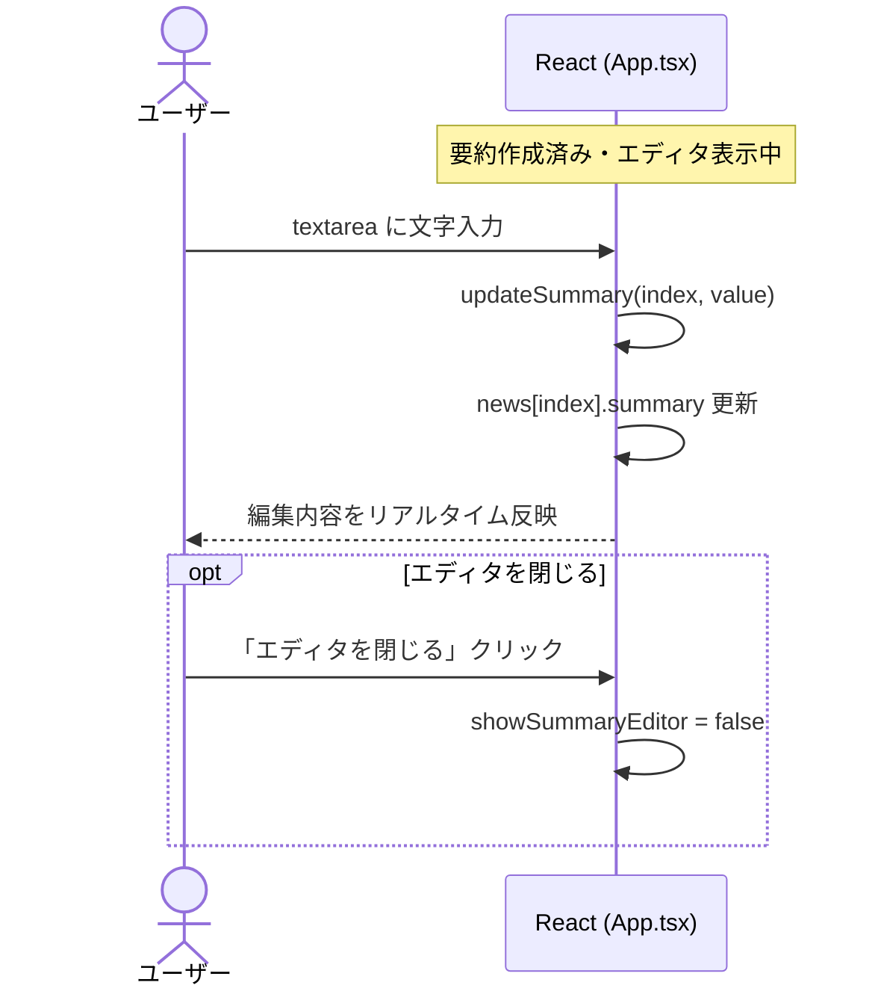

# 要約編集

---

## 機能概要

要約作成後に表示されるテキストエリアで、要約内容を手動編集する機能。編集結果は React ステート上に保持され、Slack 投稿時に使用される。

本機能はサーバー側 API を持たず、フロントエンドのみで完結する。

---

## 対象ユーザー

社内担当者。Slack 共有前に要約文面を調整するユーザー。

---

## 入力

| 項目 | 型 | 必須 | 説明 |
|------|-----|------|------|
| 要約テキスト | string（textarea） | ○ | `updateSummary(index, value)` でステート更新 |

---

## 出力

| 項目 | 型 | 説明 |
|------|-----|------|
| 編集済み要約 | string | `news[index].summary` に反映 |
| エディタ表示状態 | boolean | `showSummaryEditor` で開閉 |

---

## バリデーション

| 項目 | ルール | 備考 |
|------|--------|------|
| 要約テキスト | 制限なし | 空文字も技術的には可能。Slack 投稿時に summary 必須チェックあり |
| 編集可能条件 | `summary` が存在すること | 要約未作成時はエディタ非表示 |

---

## 業務ルール

- エディタは要約作成成功後に自動表示（`showSummaryEditor: true`）
- 「エディタを開く」/「エディタを閉じる」ボタンで表示切替（`toggleSummaryEditor`）
- 編集内容はページリロードまでメモリ上にのみ保持
- 要約再生成（`handleSummarize`）すると API レスポンスで上書きされる

---

## API

該当なし（クライアントサイドのみ）。

Slack 投稿時に編集済み要約が `POST /api/slack` の `text` として送信される。詳細は [slack_post.md](slack_post.md) を参照。

---

## DB 利用テーブル

該当なし。

---

## エラーハンドリング

| 状況 | 対応 |
|------|------|
| 要約未作成で Slack 投稿 | 「エラー: 先に要約を作成してください。」（フロントエンドガード） |

---

## シーケンス図

---

## TODO

- 文字数上限・プレースホルダ以外の入力ガイドの要否
- 編集内容の自動保存（localStorage 等）の要否
- 要約再生成時の編集内容上書き確認ダイアログの要否
