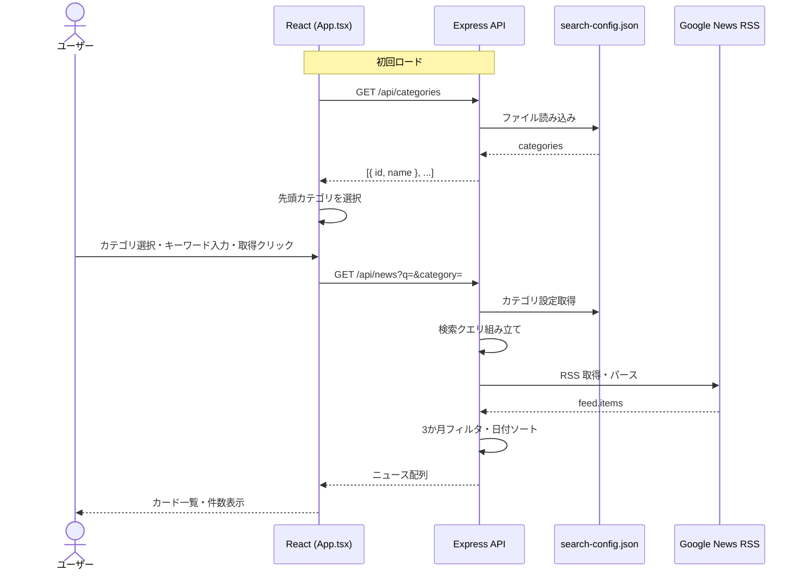

# ニュース一覧

---

## 機能概要

Google News RSS からカテゴリおよび追加検索ワードに基づいてニュースを取得し、カード形式の一覧として表示する機能。取得した記事は公開日の新しい順に並び、直近 3 か月以内の記事のみ表示対象となる。

---

## 対象ユーザー

社内担当者（認証なし）。ニュース収集・確認を行うユーザーが利用する。

---

## 入力

| 項目 | 型 | 必須 | 説明 |
|------|-----|------|------|
| カテゴリ | string（select） | ○ | `search-config.json` のカテゴリ ID。初回ロード時に先頭カテゴリが自動選択 |
| 追加検索ワード | string（text input） | — | RSS クエリ末尾に連結する任意キーワード |
| 取得ボタン | button click | ○ | 「最新ニュースを取得」クリックで API 呼び出し |

---

## 出力

| 項目 | 型 | 説明 |
|------|-----|------|
| ニュースカード一覧 | array | 各カードにタイトル、ソース、公開日、操作ボタンを表示 |
| 取得件数 | number | 検索バー横に「取得件数: N件」と表示 |
| ステータス | string | 「ニュースを取得中...」等の操作状況メッセージ |

各ニュース項目の API レスポンス形式:

| フィールド | 型 | 説明 |
|-----------|-----|------|
| `title` | string | 記事タイトル |
| `link` | string | 元記事 URL |
| `pubDate` | string | 公開日（RSS の pubDate） |
| `content` | string | 記事スニペット（`contentSnippet` または `content`） |
| `source` | string | 情報源（未取得時は `'不明'`） |

---

## バリデーション

| 項目 | ルール | 備考 |
|------|--------|------|
| カテゴリ | 未指定時はバックエンドで先頭カテゴリを使用 | フロントは初回ロード後に先頭を設定 |
| 追加検索ワード | 制限なし | 空文字可 |

---

## 業務ルール

- RSS 検索クエリ: `(keyword1 OR keyword2 ...) AND (filter1 OR filter2 ...) [追加キーワード]`
- Google News RSS のパラメータ: `hl=ja&gl=JP&ceid=JP:ja`（日本語・日本向け）
- 公開日が実行日から **3 か月より前** の記事は除外
- 残った記事は **公開日降順** でソート
- カテゴリ ID が `search-config.json` に存在しない場合、先頭カテゴリの設定を使用

---

## API

### カテゴリ一覧取得

| 項目 | 値 |
|------|-----|
| メソッド | GET |
| パス | `/api/categories` |
| 認証 | なし |

**レスポンス例**

```json
[
  { "id": "labor", "name": "労務" },
  { "id": "ai", "name": "AI関連" }
]
```

### ニュース一覧取得

| 項目 | 値 |
|------|-----|
| メソッド | GET |
| パス | `/api/news` |
| 認証 | なし |
| クエリ | `q`（追加検索ワード）, `category`（カテゴリ ID） |

**レスポンス例**

```json
[
  {
    "title": "記事タイトル",
    "link": "https://example.com/article",
    "pubDate": "Mon, 01 Jun 2026 10:00:00 GMT",
    "content": "記事のスニペット...",
    "source": "Example News"
  }
]
```

---

## DB 利用テーブル

該当なし（DB 未使用）。

---

## エラーハンドリング

| エラー | 原因 | HTTP ステータス | ユーザーへの表示 |
|--------|------|----------------|-----------------|
| 設定読み込み失敗 | `search-config.json` 不正 | 500 | カテゴリ取得時: コンソールエラーのみ |
| RSS 取得失敗 | 外部 RSS エラー・ネットワーク | 500 | 「エラー: ニュースの取得に失敗しました。」 |
| 取得中 | — | — | ボタン無効化、「取得中...」表示 |

---

## シーケンス図



---

## TODO

未完了事項は [docs/TODO.md](../TODO.md)（TODO-100 〜 TODO-102）を参照。
