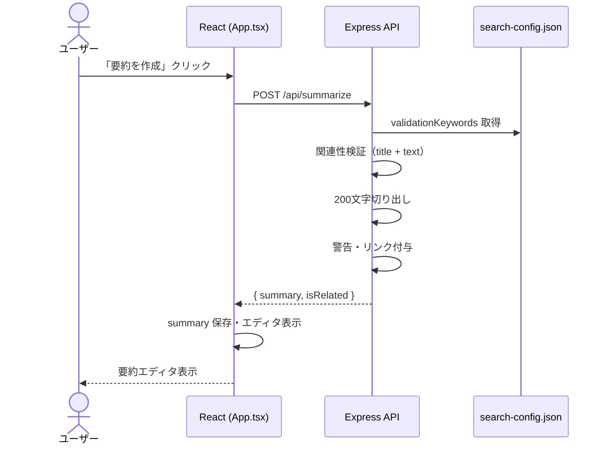

# 要約作成

---

## 機能概要

ニュースカードの RSS スニペットを簡易要約し、選択カテゴリとの関連性を検証する機能。要約作成後はテキストエディタが表示され、ユーザーが内容を確認・編集できる。

本機能の要約は LLM 等の AI による生成ではなく、**200 文字での切り出し** による簡易処理である。記事の見出し情報として、伝えたい内容を長すぎず短すぎない構成で Slack に投稿するための方式。

---

## 対象ユーザー

社内担当者。ニュース内容を Slack 共有用に整形するユーザー。

---

## 入力

| 項目 | 型 | 必須 | 説明 |
|------|-----|------|------|
| `text` | string | ○ | 記事スニペット（`content`） |
| `title` | string | — | 記事タイトル（関連性検証に使用） |
| `category` | string | — | カテゴリ ID（未指定時は先頭カテゴリ） |
| `link` | string | — | 元記事 URL（要約末尾に付与） |

フロントエンドは「要約を作成」/「要約を再生成」ボタンクリックで上記を `POST /api/summarize` に送信する。

---

## 出力

| 項目 | 型 | 説明 |
|------|-----|------|
| `summary` | string | 要約テキスト（警告・リンク含む場合あり） |
| `isRelated` | boolean | カテゴリ関連性の判定結果 |
| 要約エディタ | UI | `showSummaryEditor: true` で textarea 表示 |

要約テキストの構成:

1. 関連性が低い場合: 先頭に `【注意：[カテゴリ名]に関連する可能性が低いです】`
2. 本文: 200 文字超の場合は先頭 200 文字 + `...`、それ以外は全文
3. 末尾: `link` 指定時は `\n\n記事全文: {link}`

---

## バリデーション

| 項目 | ルール | エラーメッセージ |
|------|--------|-----------------|
| `text` | 必須 | 「テキストが必要です。」（HTTP 400） |

---

## 業務ルール

- 関連性判定: `title + text` を小文字化し、`validationKeywords` のいずれかが含まれるかを `some()` で判定
- `validationKeywords` が空配列のカテゴリ（`none`）では、キーワード一致なし → `isRelated: false` となる
- 要約再生成時も同 API を再呼び出し、エディタ内容を上書き
- 要約作成前に Slack 投稿は不可（フロントエンドでガード）

---

## API

### 要約作成

| 項目 | 値 |
|------|-----|
| メソッド | POST |
| パス | `/api/summarize` |
| 認証 | なし |
| Content-Type | application/json |

**リクエスト例**

```json
{
  "text": "記事のスニペット本文...",
  "title": "記事タイトル",
  "category": "labor",
  "link": "https://example.com/article"
}
```

**レスポンス例**

```json
{
  "summary": "【注意：労務に関連する可能性が低いです】\n記事のスニペット...\n\n記事全文: https://example.com/article",
  "isRelated": false
}
```

---

## DB 利用テーブル

該当なし。

---

## エラーハンドリング

| エラー | 原因 | HTTP ステータス | ユーザーへの表示 |
|--------|------|----------------|-----------------|
| テキスト未指定 | `text` が空 | 400 | 「エラー: 要約の作成に失敗しました。」 |
| サーバーエラー | 設定読み込み失敗等 | 500 | 「エラー: 要約の作成に失敗しました。」 |
| 成功 | — | 200 | 「要約を作成しました。」 |

---

## シーケンス図



---

## TODO

未完了事項は [docs/TODO.md](../TODO.md)（TODO-022、TODO-023、TODO-120、TODO-041）を参照。

採用理由は [docs/decision_log.md](../decision_log.md)（判断 4）を参照。
