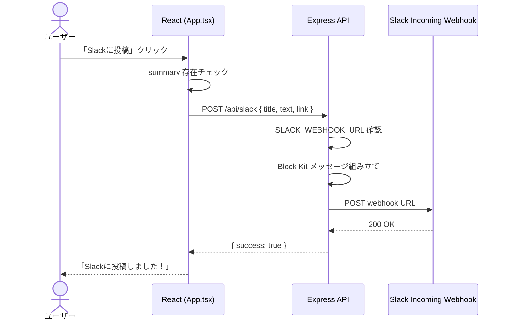

# Slack 投稿

---

## 機能概要

編集済み要約を Slack Incoming Webhook 経由で指定チャンネルに投稿する機能。Block Kit 形式のメッセージ（タイトル・要約本文・記事リンク）を送信する。

---

## 対象ユーザー

社内担当者。要約を社内 Slack チャンネルで共有するユーザー。

---

## 入力

| 項目 | 型 | 必須 | 説明 |
|------|-----|------|------|
| `title` | string | ○ | 記事タイトル（Slack メッセージ見出し） |
| `text` | string | ○ | 編集済み要約本文 |
| `link` | string | ○ | 元記事 URL（「記事全文を読む」リンク） |

フロントエンド前提条件: 対象ニュースに `summary` が存在すること。

---

## 出力

| 項目 | 型 | 説明 |
|------|-----|------|
| 成功レスポンス | `{ success: true }` | API 200 |
| ステータス表示 | string | 「Slackに投稿しました！」 |

Slack 側メッセージ構成（Block Kit）:

1. Section: `*{title}*\n{text}`（mrkdwn）
2. Section: `<{link}|記事全文を読む>`（mrkdwn）

---

## バリデーション

| 項目 | ルール | エラーメッセージ |
|------|--------|-----------------|
| `summary`（フロント） | 要約作成済みであること | 「エラー: 先に要約を作成してください。」 |
| `SLACK_WEBHOOK_URL`（バック） | 環境変数が設定されていること | 「Slack Webhook URLが設定されていません。」（HTTP 500） |

---

## 業務ルール

- Webhook URL は `backend/.env` の `SLACK_WEBHOOK_URL` から取得
- 投稿先チャンネルは Webhook 作成時に Slack 側で決定（アプリ側からチャンネル指定なし）
- 投稿成功・失敗はフロントエンドのステータスバッジに表示

---

## API

### Slack 投稿

| 項目 | 値 |
|------|-----|
| メソッド | POST |
| パス | `/api/slack` |
| 認証 | なし |
| Content-Type | application/json |

**リクエスト例**

```json
{
  "title": "記事タイトル",
  "text": "編集済み要約本文...",
  "link": "https://example.com/article"
}
```

**レスポンス例（成功）**

```json
{
  "success": true
}
```

---

## DB 利用テーブル

該当なし。

---

## エラーハンドリング

| エラー | 原因 | HTTP ステータス | ユーザーへの表示 |
|--------|------|----------------|-----------------|
| Webhook 未設定 | `SLACK_WEBHOOK_URL` なし | 500 | 「エラー: Slackへの投稿に失敗しました。」 |
| Slack API エラー | Webhook 無効・ネットワーク等 | 500 | 「エラー: Slackへの投稿に失敗しました。」 |
| 要約未作成 | フロントエンドガード | — | 「エラー: 先に要約を作成してください。」 |
| 成功 | — | 200 | 「Slackに投稿しました！」 |

サーバー側は `console.error('Slack Post Error:', error)` でログ出力。

---

## シーケンス図



---

## TODO

未完了事項は [docs/TODO.md](../TODO.md)（TODO-140、TODO-141、TODO-042）を参照。
