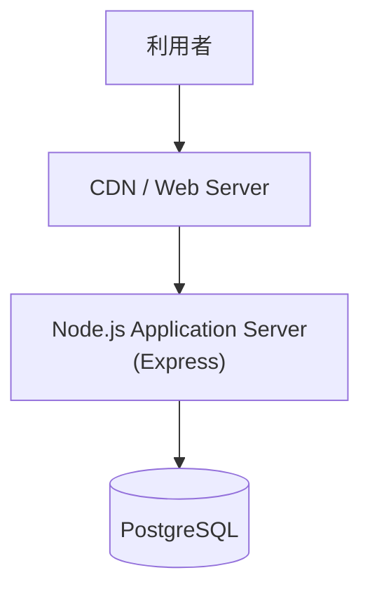
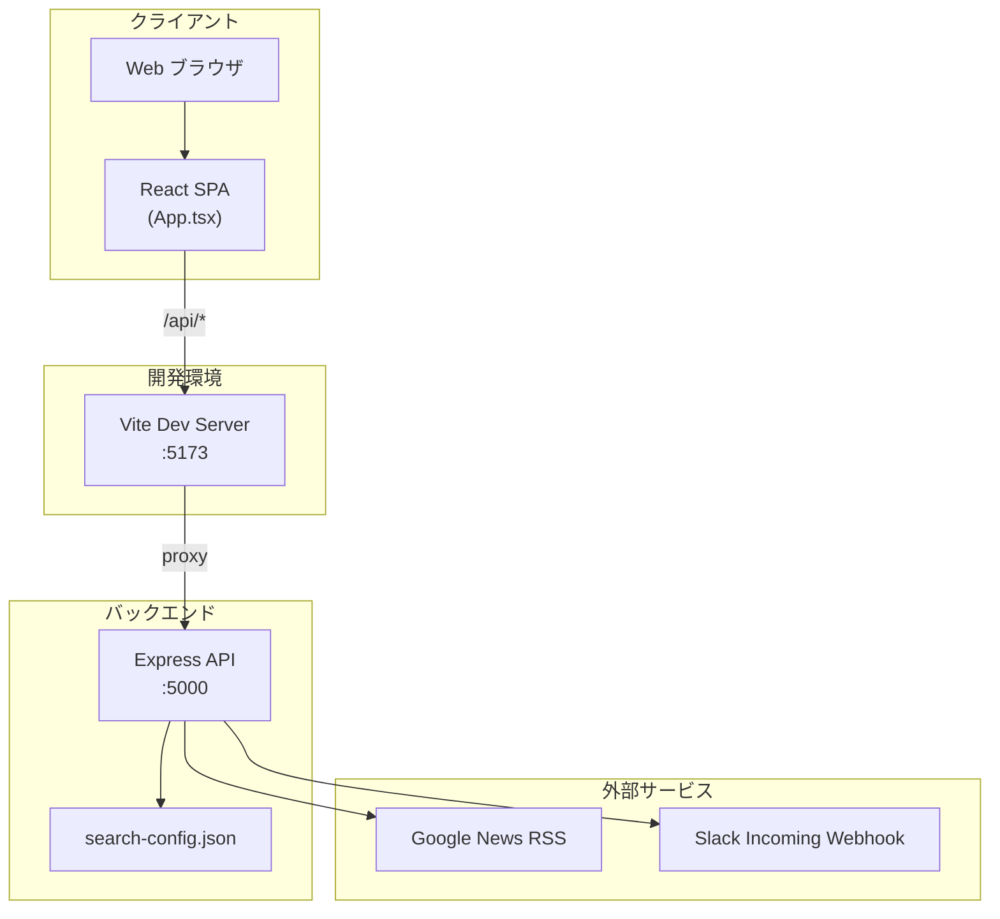

# システムアーキテクチャ

---

## システム概要

React SPA と Express REST API からなる Web アプリケーション。Google News RSS および Slack Incoming Webhook と連携する。

**現行実装**（開発環境）ではデータベースを使用せず、ニュースデータはフロントエンドの React ステート上にのみ保持される。**本番環境**の構成は未確定であり、後述のサンプル構成を参照すること。

---

## 本番環境構成（サンプル）

> **注意**: 本章はサンプル構成であり、実際の本番環境と異なる可能性がある。インフラ担当者のレビューを前提とした仮置きである。

本番デプロイ構成は現時点では未確定。以下は想定される構成のサンプル。

| レイヤー | 技術 | 備考 |
|---------|------|------|
| フロントエンド | React | ビルド成果物を CDN / Web Server から配信 |
| バックエンド | Node.js + Express | アプリケーションサーバー |
| データベース | PostgreSQL | 将来のトレンド収集等を見据えた永続化（現行実装では未使用） |
| ランタイム | Node.js 22.x LTS | 推奨バージョン（仮） |

### 本番構成図（サンプル）

---

## 現行構成（開発環境）

開発環境では Vite 開発サーバーと Express API を別プロセスで起動し、データベースは使用しない。

### 開発環境構成図

---

## 技術スタック

| レイヤー | 技術 | バージョン（package.json 記載） | 備考 |
|---------|------|-------------------------------|------|
| フロントエンド | React | ^18.2.0 | SPA、単一コンポーネント構成 |
| フロントエンド | TypeScript | ^5.2.2 | |
| フロントエンド | Vite | ^5.0.0 | 開発サーバー・ビルド |
| フロントエンド | Axios | ^1.6.2 | API 通信 |
| フロントエンド | Vanilla CSS | — | `index.css` |
| バックエンド | Node.js | 22.x LTS（推奨・仮） | 本番サンプル構成。現行 `package.json` に `engines` 未定義 |
| バックエンド | Express | ^4.18.2 | REST API |
| バックエンド | rss-parser | ^3.13.0 | RSS 解析 |
| バックエンド | Axios | ^1.6.2 | Slack 投稿 |
| バックエンド | dotenv | ^16.3.1 | 環境変数 |
| バックエンド | cors | ^2.8.5 | CORS 有効化 |
| データベース（現行） | なし | — | 永続化レイヤーなし |
| データベース（本番サンプル） | PostgreSQL | — | 仮構成。インフラ担当レビュー待ち |
| インフラ（本番） | CDN / Web Server + Node.js | — | サンプル構成のみ。未確定 |

---

## 主要コンポーネント

### Web クライアント（`frontend/`）

React + TypeScript の SPA。`App.tsx` に UI・状態管理・API 呼び出しが集約されている。

- カテゴリ一覧の取得・選択
- ニュース一覧の取得・カード表示
- 要約作成・編集・Slack 投稿の UI
- 操作ステータス・取得件数の表示

開発時は Vite が `/api` を `http://localhost:5000` にプロキシする（`vite.config.ts`）。

### API サーバー（`backend/index.js`）

Express ベースの REST API。4 つのエンドポイントを提供する。

| エンドポイント | 責務 |
|---------------|------|
| `GET /api/categories` | カテゴリ一覧返却 |
| `GET /api/news` | Google News RSS 取得・フィルタ・ソート |
| `POST /api/summarize` | 簡易要約・関連性検証 |
| `POST /api/slack` | Slack Webhook 投稿 |

設定は `search-config.json` を起動時にファイル読み込みで取得する（`getConfig()`）。

---

## データの流れ

### ニュース取得フロー

1. ユーザーがカテゴリ・追加検索ワードを指定し「最新ニュースを取得」をクリック
2. フロントエンドが `GET /api/news?q={keyword}&category={categoryId}` を呼び出す
3. バックエンドが `search-config.json` からカテゴリ設定を読み込む
4. 検索クエリ `(keywords OR ...) AND (filters OR ...) [追加キーワード]` を組み立てる
5. Google News RSS URL にリクエストし、RSS をパースする
6. 公開日が 3 か月以内の記事のみ抽出し、日付降順でソート
7. `{ title, link, pubDate, content, source }` 形式の JSON 配列を返却
8. フロントエンドがニュースカード一覧として表示

### 要約・Slack 投稿フロー

1. ユーザーが「要約を作成」をクリック
2. フロントエンドが `POST /api/summarize` に `{ text, title, category, link }` を送信
3. バックエンドが 200 文字切り出し・関連性検証・リンク付与を行い `{ summary, isRelated }` を返却
4. ユーザーがテキストエリアで要約を編集
5. 「Slackに投稿」クリックで `POST /api/slack` に `{ title, text, link }` を送信
6. バックエンドが Slack Block Kit 形式のメッセージを Webhook に POST

---

## 外部連携

| 連携先 | 目的 | 方式 | 認証・設定 |
|--------|------|------|-----------|
| Google News RSS | ニュース記事の取得 | HTTP GET（RSS） | クエリパラメータ（`hl=ja&gl=JP&ceid=JP:ja`） |
| Slack Incoming Webhook | 要約のチャンネル投稿 | HTTP POST（JSON） | 環境変数 `SLACK_WEBHOOK_URL` |

---

## 非機能要件

| 項目 | 現状（コードから判断） | 備考 |
|------|----------------------|------|
| 可用性 | TODO | 定義なし |
| 性能 | TODO | 定義なし。RSS 取得は外部 API 依存 |
| セキュリティ | 認証なし、CORS 全許可 | 試験運用中。認証は将来追加予定 |
| スケーラビリティ | ステートレス API（DB なし） | 単一プロセス想定 |
| 運用・監視 | `console.error` によるログ出力 | 構造化ログ・監視は未実装 |
